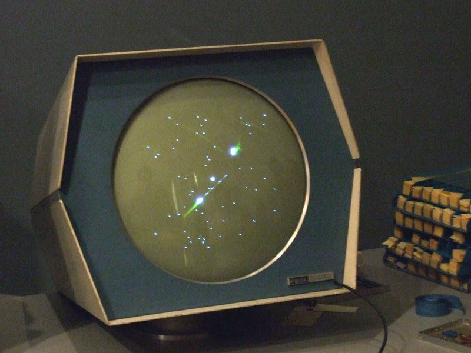
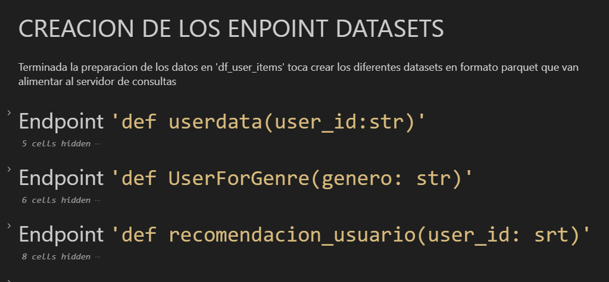
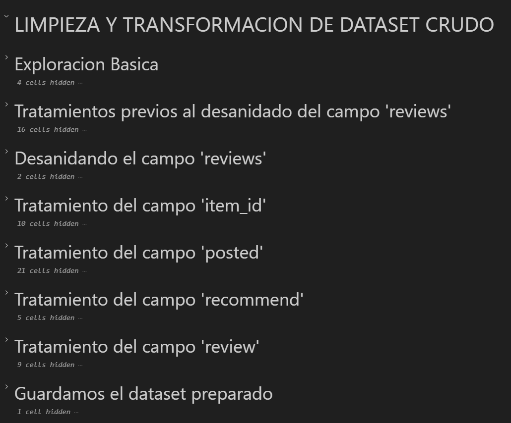
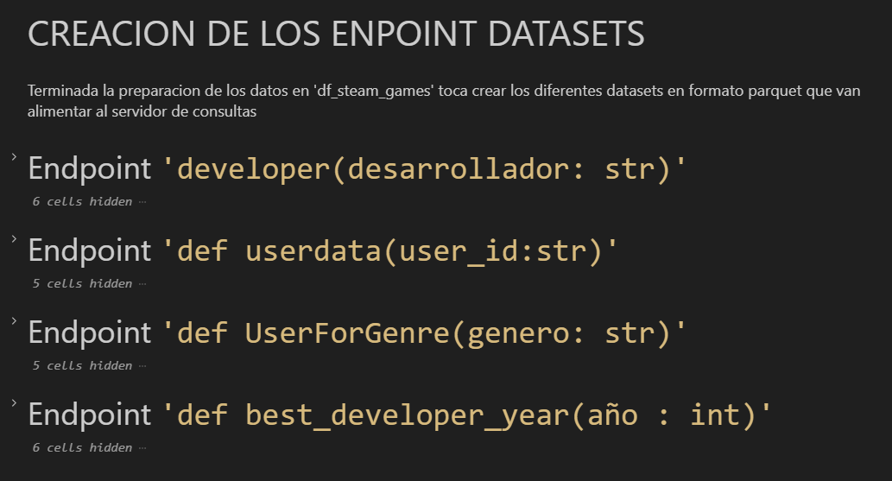

# <h1 align=center> **`PROYECTO MLOps`** </h1>

# <h1 align=center>**`Implementación de un Servidor de Consultas Steam`**</h1>

<p align="center">
    
</p>
<br>

<p align="center">
  Check out the live demo of this project  
  <a href="https://simple-bank-dapp-fawn.vercel.app">HERE</a>
</p>

<p align="center">
  Lee este archivo en <a href="README.md">inglés</a> / Read this in <a href="README.md">English</a>
</p>


<br>


<!-- # <h1 align=center>**`Hoover Pedro Zavala`**</h1>
<h4 align=center>**`Data Analysis | Data Engineering | Data Modeling | Data Science | BI & Data Analytics`**</h4> -->

<hr> 

## Tabla de Contenido

1. **[Introducción](#1-introduccion)**
2. **[Alcance del Proyecto](#2-alcance-del-proyecto)**
3. **[Estructura del Repositorio](#3-estructura-del-repositorio)**
4. **[Cómo Empezar](#4-cómo-empezar)**
5. **[Tech Stack](#5-tech-stack)**
6. **[Flujo de Trabajo](#6-flujo-de-trabajo)**
7. **[Próximos Pasos](#7-próximos-pasos)**
8. **[Contacto](#8-contacto)**

<br>

## 1. Introducción <a name="introduccion"></a>

**Breve Historia del Videojuego**

Desde los años 50, los laboratorios comenzaron a diseñar los primeros videojuegos, que servirían tanto para probar las capacidades técnicas de los sistemas electrónicos a su alcance, como de las primeras computadoras construidas en esas épocas. 

Destacan de ese periodo el juego 'Tennis for Two', desarrollado en 1958 por William Higinbotham de la Brookhaven National Library, usando una pantalla de osciloscopio y circuitería de transistores.
Otro desarrollo importante fue el 'Spacewar!', el primer juego computarizado de la historia, desarrollado en 1962 por el estudiante del MIT Steve Russell, aplicando gráficos vectoriales sobre un miniordenador PDP-1.
Estos primeros videojuegos no tenían un propósito comercial. 

<div style="display: flex; justify-content: center;">
    <div style="margin-right: 60px;">
        
    </div>
    <div>
        
    </div>
</div>

<br>

Recién en los 70s con el videojuego 'Computer Space' de 1971, basado en el Spacewar! de 1962, arrancó el mercado de videojuegos, siendo 'Pong' de la empresa Atari en 1972 la piedra angular del videojuego como industria en esas fechas. 

En los 80s comenzó una nueva era en la industria donde Namco desarrolla Pac Man, Atari crea Space Invaders y donde después la japonesa Nintendo se convierte en líder del mercado con títulos como Donkey Kong, Super Mario Bros y Tetris. 

En los noventa, con el avance de la tecnología de chips, los fabricantes de consolas se convierten en las locomotoras de la industria; se termina el monopolio de Nintendo y empieza la guerra de las consolas entre Nintendo, Sega, Sony y posteriormente, Microsoft.
Hoy en día en el mercado de consolas compiten Sony con su Playstation, Microsoft con Xbox, y Nintendo con su consola Wii.

<p align="center">
        
</p>

**El Rol del Desarrollo en la Industria de Videojuegos**

La industria del videojuego es un sector económico que implica el desarrollo, distribución y venta de videojuegos, así como todo el hardware asociado. 
De esa cadena, el desarrollo es la etapa más importante, pues si bien es similar al de cualquier desarrollo de software, aquí el componente artístico toma mucha más fuerza debido a la importancia de la interfaz, la banda sonora, la historia, el diseño de personajes, etc. 

<!-- <p align="center">
            
</p> -->

<br>

Es menester puntualizar que, si bien los grandes conglomerados de desarrolladores lideran el mercado del videojuego dejando menos espacio para las pequeñas y medianas, también es cierto que el dinamismo que caracteriza a esta industria, sumado a los continuos avances tecnológicos está creando actualmente y seguirá creando nuevas oportunidades de negocios. 
<span style="float:right;">[arriba](#tabla-de-contenido)</span> 

<br>

## 2. Alcance del Proyecto <a name="alcance"></a>

Este proyecto tiene como objetivo **desarrollar un servidor de consultas online que acepte peticiones sobre los datos de los usuarios y los juegos disponibles en la plataforma digital Steam**.

Para llevar a cabo este desarrollo, se utilizaron tres datasets crudos como fuente de datos.

A partir de estos datasets, y aplicando procesos de **Data Preparation**, **Data Modeling** y **Deployment** usando API Restful, se implementó un servidor de consultas en formato de producto mínimo viable (MVP) que cumple con los requisitos esenciales de desarrollo y despliegue.


<span style="float:right;">[arriba](#tabla-de-contenido)</span> 

<br>

## 3. Estructura del Repositorio <a name="estructura"></a>

<p align="center">  
        
</p>

<br>

**`app.py`**: Archivo principal que contiene la implementación de la API y los endpoints para cada consulta.

**`Data Prep`**: Carpeta con notebooks de Jupyter para la preparación de datos (limpieza y transformación) para las consultas estándar y el sistema de recomendación:
    * `australian_users_items_json.ipynb`: Preparación de datos del dataset `australian_users_items_json.ipynb`.
    * `australian_user_reviews_json.ipynb`: Preparación de datos del dataset `australian_user_reviews_json.ipynb`.
    * `output_steam_games_json.ipynb`: Preparación de datos del dataset `output_steam_games_json.ipynb`.
    * `Preprocesamiento.ipynb`: Preparación de datos (merging de datasets intermedios) para el sistema de recomendación.

**`Data`**: Carpeta con los datasets preparados y listos para ser utilizados por los endpoints de `app.py`.

**`README.md`**: Este archivo.

**`src`**: Carpeta con archivos fuente (imágenes, diagramas, etc.).

**`requirements.txt`**: Archivo con la lista de dependencias necesarias para el despliegue en Render.
<span style="float:right;">[arriba](#tabla-de-contenido)</span> 

<br>

## **4. Cómo Empezar**

### 🛠️ Instalación

1. Clonar el repositorio:

   ```bash
   git clone https://github.com/pseeker33/mlops-steam-api.git
   cd steam-api
   ```

2. Crear y activar un entorno virtual (opcional pero recomendado):

   ```bash
   python -m venv venv
   source venv/bin/activate  # En Windows: venv\Scripts\activate
   ```

3. Instalar las dependencias:

   ```bash
   pip install -r requirements.txt
   ```

### ▶️ Ejecución

1. Asegúrate de tener los archivos Parquet en `data/`.

2. Inicia la API de FastAPI en tu enteono local:

   ```bash
   uvicorn app.main:app --reload
   ```

<span style="float:right;">[arriba](#tabla-de-contenido)</span> 

<br>

## **5 Tech Stack**

  
  
  
  
    
  
  

<span style="float:right;">[arriba](#tabla-de-contenido)</span> 

<br>

## 6. Flujo de Trabajo <a name="flujo"></a>

### Etapa de Data Preparation <a name="data_preparation"></a>

Etapa donde se realizó la mayor parte del trabajo. Tiene dos partes diferenciadas:

1. **Limpieza y transformación de los datasets crudos:** Se realiza los tratamientos de data cleaning y data transformation a los datasets crudos.
2. **Creación de los endpoint datasets:** Se realizan las transformaciones finales que crean los datasets finales que deben ser consumidos tanto por los endpoints de consultas estándar como por el endpoint de consulta al sistema de recomendación.

A continuación, se muestran de forma resumida los tratamientos hechos en cada dataset:

**`australian_users_items_json.ipynb`**:

<p align="left">  
          
</p>
<p align="left">  
          
</p>

<br>

**`australian_user_reviews_json.ipynb`**:

<p align="left">  
          
</p>
<p align="left">  
          
</p>

<br>

**`output_steam_games_json.ipynb`**:

<p align="left">  
          
</p>
<p align="left">  
          
</p>

<br>

**`Preprocesamiento.ipynb`**:

<p align="left">  
          
</p>

<br>

### Etapa de Deployment <a name="deployment"></a>

Etapa donde se implementó la interfaz de la API del servidor entro del archivo `app.py`. El código consiste en una serie de funciones de respuesta a las consultas del servidor para cada endpoint. 

Aquí tienes un resumen de los **endpoints** que tienes en tu proyecto FastAPI:

---

#### 1. **`/developer/`** (GET)  
- **Parámetro:** `desarrollador` (str)  
- **Descripción:**  
  - Devuelve la cantidad de juegos por año de un desarrollador.  
  - Calcula el porcentaje de juegos "Free to Play" por año.  

---

#### 2. **`/userdata/`** (GET)  
- **Parámetro:** `user_id` (str)  
- **Descripción:**  
  - Muestra el total gastado por un usuario en juegos.  
  - Calcula el porcentaje de recomendaciones positivas realizadas por el usuario.  
  - Indica la cantidad de juegos que el usuario tiene en su catálogo.  

---

#### 3. **`/UserForGenre/`** (GET)  
- **Parámetro:** `genero` (str)  
- **Descripción:**  
  - Encuentra el usuario con más horas jugadas en un género específico.  
  - Muestra las horas jugadas por año para ese género.  

---

#### 4. **`/best_developer_year/`** (GET)  
- **Parámetro:** `año` (int)  
- **Descripción:**  
  - Identifica los tres desarrolladores con más valoraciones positivas o neutrales en un año dado.  

---

#### 5. **`/developer_reviews_analysis/`** (GET)  
- **Parámetro:** `desarrolladora` (str)  
- **Descripción:**  
  - Devuelve el número de valoraciones positivas y negativas para una desarrolladora específica.  

---

#### 6. **`/recomendacion_usuario/`** (GET)  
- **Parámetro:** `user_id` (str)  
- **Descripción:**  
  - Devuelve las 5 principales recomendaciones de juegos personalizadas para un usuario.  

---


A continuación, se muestran capturas de la implementacion de los endpoints:

<div style="display: flex; justify-content: center;">
    <div style="margin-right: 70px;">
        
    </div>
    <div>
        
    </div>
</div>

<span style="float:right;">[arriba](#tabla-de-contenido)</span> 

<br>


## 7. Próximos Pasos <a name="proximos-pasos"></a>

*   Nuevas funcionalidades, como la búsqueda de juegos por género. 
*   Mejorar la precisión del sistema de recomendación utilizando algoritmos más avanzados.
*   Optimizar el rendimiento de la API para soportar un mayor número de solicitudes.

<span style="float:right;">[arriba](#tabla-de-contenido)</span> 

<br>


## 8. Contacto <a name="contacto"></a>

¡Gracias por pasar!
¿Te pareció interesante el proyecto? Entonces no olvides regalarme una ⭐. Así me ayudas con la visualización de mi trabajo.
¿Tienes una idea en mente o encontraste algún bug? Por favor, abre un issue o inicia una discusión.

**Para contactarte conmigo, escribeme al siguiente correo:  zavalah222@gmail.com**  
**O puedes usa mis redes:**
[](https://twitter.com/pseeker222)
[](https://www.linkedin.com/in/hoover-zavala-63a64825b/)

<span style="float:right;">[arriba](#tabla-de-contenido)</span> 
