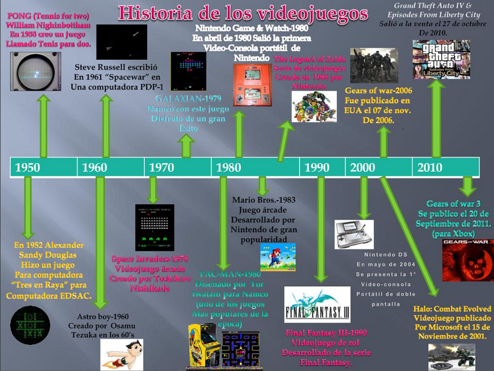
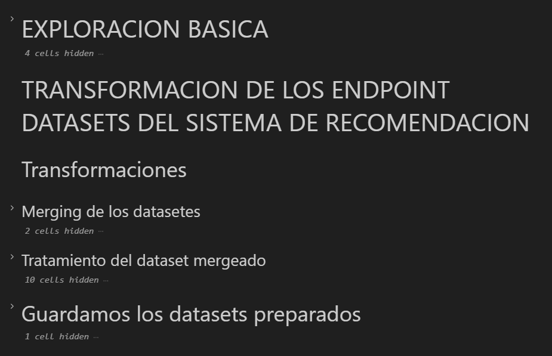
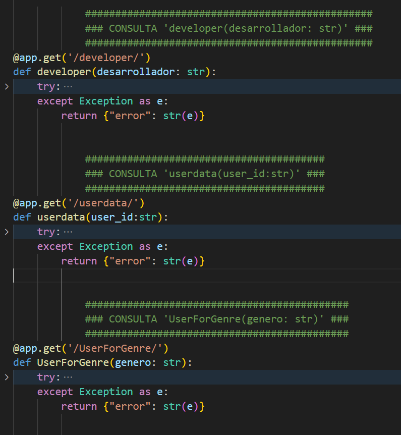

# <h1 align=center> **`PROYECTO MLOps`** </h1>

# <h1 align=center>**`Implementacion de un Servidor de Consultas  Steam`**</h1>

        

<!--

    
    

-->

# <h1 align=center>**`Hoover Pedro Zavala`**</h1><h4 align=center>**`Data Analysis | Data Engineering | Data Modeling | Data Science | BI & Data Analytics`**</h1>

<!--

**`Data Analysis | Data Engineering | Data Modeling | Data Science | BI & Data Analytics`**  

-->

<!--
# <h1 align=center>**`Hoover Zavala`**</h1><h3 align=center>`Data Engineering | BI & Data Analytics | Data Science`</h3>
-->

 
 

## Tabla de Contenido

1. **[Introducción](#1-introduccion)**

2. **[Alcance del Proyecto](#2-alcance-del-proyecto)**

3. **[Estructura del Repositorio](#3-estructura-del-repositorio)**

4. **[Flujo de Trabajo](#4-flujo-de-trabajo)**
#
 

## **1. Introduccion**

**`Breve Historia del Videojuego`**
 

Desde los años 50s los laboratorios empezaron a diseñar los primeros videojuegos, que servirían tanto para probar las capacidades técnicas de los sistemas electronicos a su alcance, como de las primeras computadoras construidas en esas epocas.  

Destacan de ese periodo el juego 'Tennis for Two', desarrollado en 1958 por William Higinbotham de la Brookhaven National Library, usando una pantalla de osciloscopio y circuitería de transistores.
Otro desarrollo importante fue el 'Spacewar!', el primer juego computarizado de la historia, desarrollado en 1962 por el estudiante del MIT Steve Russell, aplicando gráficos vectoriales sobre un  miniordenador PDP-1.
Estos primeros videojuegos no tenían un propósito comercial.  

  

    
  

  

    
  

 
Recien en los 70s con el videojuego 'Computer Space' de 1971, basado en el Spacewar! de 1962, arranco el mercado de videojuegos, siendo 'Pong' de la empresa Atari en 1972 la piedra angular del videojuego como industria en esas fechas.  

En los 80s comenzo una nueva era en la industria donde Namco desarrolla Pac Man, Atari crea Space Invaders y donde despues la japonesa Nintendo se convierte en líder del mercado con títulos como Donkey Kong, Super Mario Bros y Tetris.  

En los noventa, con el avance de la tecnologia de chips, los fabricantes de consolas se convierten en las locomotoras de la industria; se termina el monopolio de Nintendo y empieza  la guerra de las consolas entre Nintendo, Sega, Sony y posteriormente, Microsoft.
Hoy en día en el mercado de consolas compiten Sony con su Playstation, Microsoft con Xbox, y Nintendo con su consola Wii

        

**`El Rol del Desarrollo en la Industria de Videojuegos`**  
La industria del videojuego es un sector económico que implica el desarrollo, distribución y venta de videojuegos, así como todo el hardware asociado  
De esa cadena, el desarrollo es la etapa mas importante, pues si bien es similar al de cualquier desarrollo de software, aquí el componente artístico toma mucha más fuerza debido a la importancia de la interfaz, la banda sonora, la historia, el diseño de personajes, etc  

           

 

  
**Es menester puntualizar que, si bien los grandes conglomerados de desarrolladores lideran el mercado del videojuego y que esto deja poco espacio de maniobra para las pequeñas y medianas empresas, tambien es cierto que el dinamismo que caracteriza a esta industria, sumado a los continuos avances tecnologicos esta creando actualmente y seguira creando oportunidades de negocios a cada paso y en todo momento.**  
[arriba](#tabla-de-contenido)  

#
 

## **2. Alcance del Proyecto** 

En cuanto al trabajo que nos concierne, Valve Corporation, una empresa  desarrolladora de videojuegos estadounidense,  **requiere el desarrollo de un servidor de consultas online que acepte peticiones sobre los datos de los usuarios y los juegos que mantiene dentro de su plataforma digital Steam**.  

En aras de ese requerimiento, se nos pedido la tarea de implementar dicho servidor de consultas en formato de producto minimo viable (MVP) que cumpla con ciertos requisitos minimos de desarrollo y deployment.

Para esta implementacion Valve pone a nuestra disposicion tres datasets crudos que debemos usar como fuente de datos. 

A partir de esa data, y aplicando procesos de **Data Preparation**, **Data Modeling** y **Deployment** usando API Resful, **nos aplicaremos al desarrollo de dicho servidor de consultas**.  
[arriba](#tabla-de-contenido)  

#
 

## 3. **Estructura del Repositorio**

<!--## 3. **<u>Estructura del Repositorio</u>** -->
 

  
        

 

**`Archivo 'app.py'.-`** en este archivo se implementaron la interfaz de la API y los procesos para los endpoints de cada consulta

**`Carpeta 'Data Prep'.-`** contiene todos los notebooks usados para el proceso de preparacion de datos (limpieza y transformacion), tanto para las consultas estandar como la consulta al sistema de recomendacion:
* **`Notebook 'australian_users_items_json.ipynb':`** data prep (limpieza y transformacion) del dataset 'australian_users_items_json.ipynb'.
* **`Notebook 'australian_user_reviews_json.ipynb':`** data prep (limpieza y transformacion) del dataset 'australian_user_reviews_json.ipynb.
* **`Notebook 'output_steam_games_json.ipynb':`** data prep (limpieza y transformacion) del dataset 'output_steam_games_json.ipynb'.
* **`Notebook 'Preprocesamiento.ipynb':`** data prep (limpieza y transformacion,  basicamente merging de datasets intermedios) para el sistema de recomendacion.

**`Carpeta 'Data'.-`** contiene todos los datasets debidamente preparados y listos para fungir de inputs de los diferentes endpoints de 'app.py'

**`Archivo 'README.md'.-`** el archivo actual.  
**`Carpeta 'src'.-`** carpeta fuente del archivo actual.  
**`Archivo 'requirements.txt'.-`** este archivo almacena la lista de las dependencias necesarias para el correcto funcionamiento del proyecto.  
[arriba](#tabla-de-contenido)  

#
 

## 4. **Flujo de Trabajo** 

### **<u>`Tech Stack`</u>**  
     
     
     
     
       
     
     
   
<!--  -->

### **<u>`Etapa de Data Preparation`</u>**

Esta es la etapa principal del proyecto, donde se realizo la mayor parte del trabajo.   Podemos dividir esta etapa en dos partes diferenciadas:

**`1) Limpieza y transformacion de los datasets crudos.-`** se realiza los tratamientod de data cleaning y data transformation) a los datasets crudos

**`2) Creacion de los endpoint datasets.-`** se realizan los tratamientos de transformacion final que crea los datasets finales que deben ser consumidos  tanto por los endpoints de consultas estandar como por el endpoint de consulta al sistema de recomendacion

A continuacion se muestran de forma resumida los tratamientos hechos en cada dataset:

**`Notebook 'australian_users_items_json.ipynb':`**  

  
        

  
        

 

**`Notebook 'australian_user_reviews_json.ipynb':`**

  
        

  
        

 

**`Notebook 'output_steam_games_json.ipynb':`** 

  
        

  
        

 

**`Notebook 'Preprocesamiento.ipynb':`** 

  
        

### **<u>`Etapa de Deployment`</u>**

En esta etapa se escribio todo el codigo para la implementacion de la interfaz de la API del servidor, y las funciones de respuesta a las consultas del servidor para cada endpoint.  
Toda la implementacion se realizo dentro del 'archivo app'.py. A continuacion se muestran capturas de los endpoints:  
 

 

  

    
  

  

    
  

[arriba](#tabla-de-contenido)  

#
 

## Gracias por pasar!
Te parecio interesante el proyecto? Entonces no olvides [regalame](https://github.com/pseeker33/P22/stargazers) una ⭐. Así me ayudas con la visualizacion de mi trabajo. 
Tienes una idea en mente o encontraste algun bug? Por favor abre un [issue](https://github.com/pseeker33/P22/issues) o inicia una [discusion](https://github.com/pseeker33/P22/discussions).

<!--  
[Texto del enlace](URL del enlace){target="_blank"}

[ <a href="#table-of-contents">↑ Back to top ↑</a> ]
 -->

**Para contactarte conmigo, escribeme al siguiente correo:  zavalah222@gmail.com**  
**O puedes usa mis redes:**  

---
